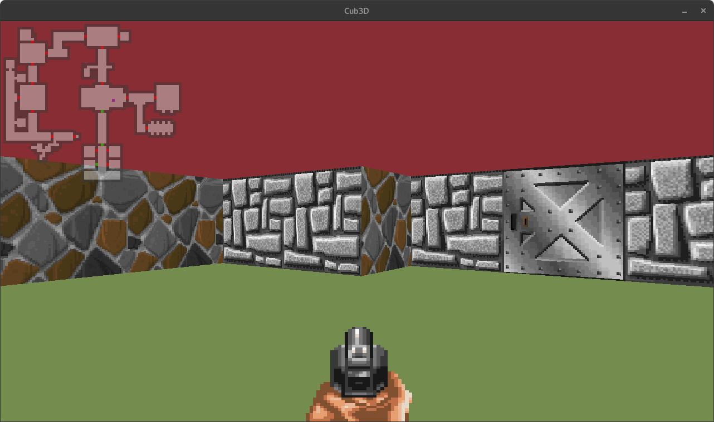

# Cub3d

Introduction to graphics programming in C by creating a simple raycasting engine similar to Wolfenstein3D.

	

## The Project

The goal of the project is to create a 3D environment with raycasting, using minilibX (a minimalistic graphics library).

### Build and run

Build the project using ``make bonus`` then run it with ``./cub3d_bonus [path_to_map_file]``

### Controls

``W`` ``A`` ``S`` ``D`` : Movement

``←`` ``→`` : Look around

``TAB`` : Toggle minimap on/off

``SPACE`` : Fire

``H`` : Toggle rotation with mouse

``E`` : Open / Close doors

## Configuration file

The program takes the path to a `.cub` file as its only parameter.

The first 8 lines must contains the following :
- ``NO`` : path to north wall texture
- ``SO`` : path to south wall texture
- ``EA`` : path to east wall texture
- ``WE`` : path to west wall texture
- ``G`` : path to gun texture
- ``D`` : path to door texture
- ``F`` : floor color as comma separated RGB values (ie: `255,255,255`)
- ``C`` : ceiling color as comma separated RGB values (ie: `255,255,255`)
